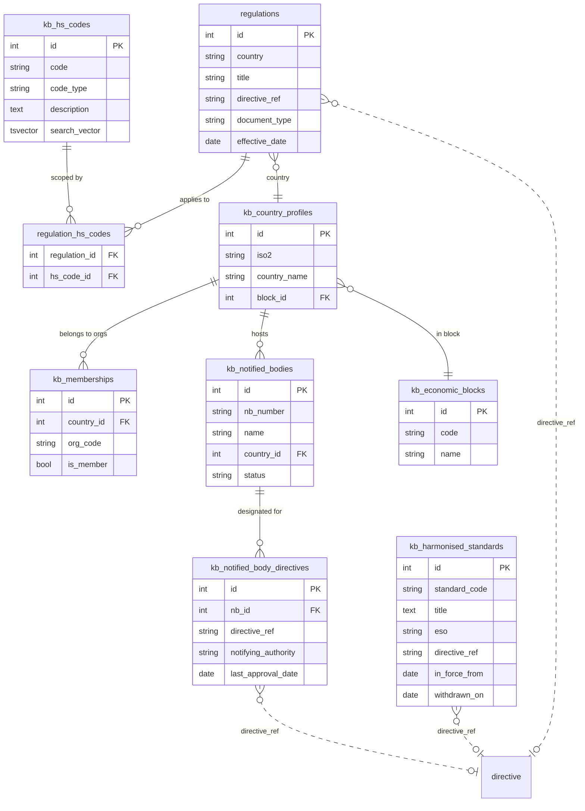
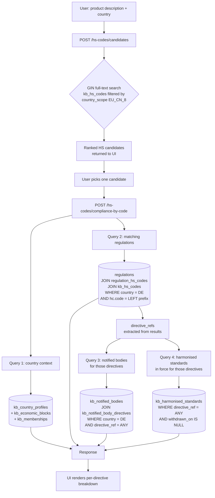
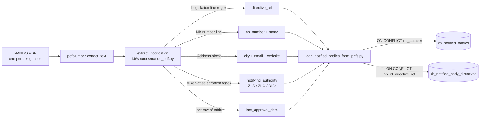
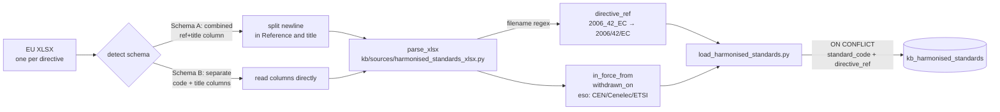

# Compliance flow — DE end-to-end

How the system answers "what do I need to sell this product in Germany?"
using only data loaded into the KB — no LLM required at query time.

## 1. What gets loaded

Three authoritative sources feed the DE knowledge base:

| Source | Format | Loader | Target tables |
|---|---|---|---|
| EU Combined Nomenclature | CSV | `hs_library/load_eu_cn.py` | `kb_hs_codes` (EU_CN_8) |
| WCO HS headings | CSV | `hs_library/load_wco.py` | `kb_hs_codes` (WCO_6) |
| EUR-Lex regulations (DE-relevant directives) | hand-curated seed | `kb/seed_reference.py` | `regulations`, `regulation_hs_codes` |
| NANDO notified-body PDFs | 328 PDFs | `kb/load_notified_bodies_from_pdfs.py` | `kb_notified_bodies`, `kb_notified_body_directives` |
| EU harmonised standards | 5 XLSX (one per directive) | `kb/load_harmonised_standards.py` | `kb_harmonised_standards` |

Loaded volumes for DE as of last run:

- **5** regulations (Machinery, LVD, EMC, MDR, RoHS)
- **186** unique notified bodies / **324** designations across **30** directives
- **2,425** harmonised-standard rows (**1,579** currently in force)
- **~9,500** HS codes (WCO 6-digit + EU CN 8-digit)

## 2. Database schema — how the tables connect

Key join keys:

- `regulation_hs_codes.hs_code_id → kb_hs_codes.id` links regulations to HS codes.
  Prefix match: `hc.code = LEFT(product_hs_code, LENGTH(hc.code))` so a chapter-level regulation (`84`) still matches an 8-digit product (`84135030`).
- `regulations.directive_ref` is the string-level join key (`2006/42/EC`, `2014/35/EU`, …) against both `kb_notified_body_directives.directive_ref` and `kb_harmonised_standards.directive_ref`. There is no foreign key to a directives table; the `directive_ref` string *is* the identity.
- `kb_harmonised_standards` has a partial index `WHERE withdrawn_on IS NULL` — the "in force" query is O(log n) on that partial index.

## 3. Query flow — product to full compliance answer

Everything after the candidate pick is pure SQL. No LLM call in the hot path — the system answers deterministically from loaded data.

## 4. Ingestion pipelines — how each source reaches the DB

### NANDO notified bodies (328 PDFs → 186 bodies / 324 designations)

Key fix: `directive_ref` is extracted from the PDF body's `Legislation:` line, **not** from the filename — EU serves the same file under multiple names and downloads can double-suffix extensions.

3 PDFs are legitimately skipped — they are Recognised Third-Party Organisations under the Pressure Equipment Directive and have no NB number.

### EU harmonised standards (5 XLSX → 2,425 rows)

The RoHS file (`2011_65_EU.xlsx`) is a legacy OLE `.xls` served under an `.xlsx` name — `_read_excel_any()` falls back from openpyxl to xlrd.

## 5. API surface

| Endpoint | Input | What it exercises |
|---|---|---|
| `GET /countries/{iso2}` | `DE` | `kb_country_profiles` + `kb_economic_blocks` + `kb_memberships` |
| `GET /regulations?country=DE` | `DE` | `regulations` list |
| `POST /hs-codes/search` | `{product_description, country_scope}` | two-tier classifier (lookup → GIN → LLM) |
| `POST /hs-codes/candidates` | `{country_code, product_description, limit}` | **GIN FTS only, no LLM** — powers the UI candidate list |
| `POST /hs-codes/compliance-by-code` | `{country_code, hs_code}` | skips classification, runs the 4 queries in section 3 |
| `POST /hs-codes/compliance-check` | `{country_code, product_description}` | full pipeline: classify + all 4 queries |

`compliance-by-code` is the endpoint the demo UI actually hits after the user picks a candidate. It lets us exercise the DB-to-DB joins without waiting on the local LLM.

## 6. Demo UI

`api/static/index.html` — single file, vanilla JS, no build step. Served at `/`.

Two-step flow:
1. Type a product description → `POST /candidates` → ranked HS codes appear as clickable cards.
2. Click a card → `POST /compliance-by-code` → renders regulations, per-directive breakdown, notified bodies, harmonised standards.

Purpose: surface the 6,000+ HS code library and the full join chain without hardcoded products.

## 7. What each directive governs (DE coverage)

| Directive | Subject | NBs in DE | In-force standards |
|---|---|---|---|
| 2006/42/EC | Machinery | many | ~816 |
| 2014/35/EU | Low Voltage (LVD) | many | ~573 |
| 2014/30/EU | Electromagnetic Compatibility (EMC) | many | ~138 |
| 2017/745 | Medical Devices (MDR) | ZLG-notified | ~51 |
| 2011/65/EU | RoHS | — | ~1 |

## 8. Known limitations

- Standards are filtered by directive, not by HS code. An "electric drill" under the Machinery Directive surfaces all 816 Machinery standards — legally complete, but broad. A future narrowing step can keyword-match standard titles against the product description.
- Only DE is fully loaded. EU block membership is cross-country, but `regulations`, `kb_notified_bodies`, and the DE-specific directive coverage are DE-only.
- `directive_ref` is a string, not a foreign key. A typo during ingest (e.g. `2006/42/CE` vs `2006/42/EC`) would silently break the join. Guarded by regex normalisation in each loader.
- The harmonised-standards XLSXs ship in two schemas; the auto-detect is conservative but could miss a future third schema without a test fixture.
